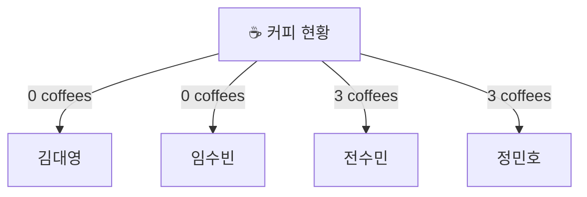

<div align="center">
	
	<br/>
	
</div>


<h2 align="center">✦ RULE ✦</h2>

```java
RULE 1: "매주 정해진 분량까지 책을 읽고 각 장별로 정리한다."
    
RULE 2: "더 알고 싶은 부분이나 모르는 부분이 있다면, 다음에 따라 정리한다.",

RULE 3: "짧은 용어 정리일 경우 markdown 각주를 이용해, 페이지 하단에 정리"

RULE 4: "Deep Dive 할 예정이면, GIT-DISCUSSION에 게시글을 올리고, 따로 정리 혹은 페이지 새로 더 파기"
    
RULE 5: "정리 못 했을 경우, 한 팀원에게 커피를 쏜다."
```




<h2 align="center">✦ 정리 현황 ✦</h2>

<div align='center'><a href="https://github.com/RealMySQL-Gang/real-my-sql-study"> </div>


