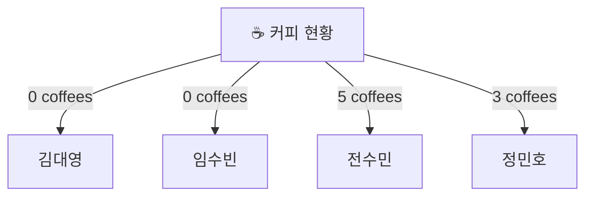

<h2 align="center">✦ RULE ✦</h2>

```diff
+ 1. 매주 금요일까지 정해진 파트 요약

+ 2. 더 찾아보고 싶은 내용은 git issue로 남기기

+ 3.차후 해당 내용을 정리해서 관련 git issue와 커밋 내역을 연결하기

- 4. 해당 주차 정리 못하면 커피 사기!
```


```mermaid
graph TD;
    A[☕ 커피 현황] -->|0 coffees| B[김대영]
    A -->|0 coffees| C[임수빈]
    A -->|5 coffees| D[전수민]
    A -->|3 coffees| E[정민호]
```

<h2 align='center'>✦ 정리 현황 ✦</h2>


<!--TREE START-->

- Geishaz/
  - Chapter 4 Architecture/
    - 📄 [4.1 MySQL 엔진 아키텍쳐.md](Geishaz/Chapter%204%20Architecture/4.1%20MySQL%20엔진%20아키텍쳐.md)
    - 📄 [4.2 InnoDB 스토리지 엔진 아키텍처.md](Geishaz/Chapter%204%20Architecture/4.2%20InnoDB%20스토리지%20엔진%20아키텍처.md)

- 📄 [README.md](README.md)

- kdozlo/
  - 03_사용자 및 권한/
    - 📄 [3.1_사용자 식별.md](kdozlo/03_사용자%20및%20권한/3.1_사용자%20식별.md)
    - 📄 [3.2_사용자 계정 관리.md](kdozlo/03_사용자%20및%20권한/3.2_사용자%20계정%20관리.md)
    - 📄 [3.3_비밀번호 관리.md](kdozlo/03_사용자%20및%20권한/3.3_비밀번호%20관리.md)
    - 📄 [3.4_권한.md](kdozlo/03_사용자%20및%20권한/3.4_권한.md)
    - 📄 [3.5_역할.md](kdozlo/03_사용자%20및%20권한/3.5_역할.md)
    - 📄 [3_DEFINER.md](kdozlo/03_사용자%20및%20권한/3_DEFINER.md)
  - 04_아키텍처/
    - 📄 [4.1_MySQL 엔진 아키텍처.md](kdozlo/04_아키텍처/4.1_MySQL%20엔진%20아키텍처.md)
    - 📄 [4.2_InnoDB 스토리지 엔진 아키텍처.md](kdozlo/04_아키텍처/4.2_InnoDB%20스토리지%20엔진%20아키텍처.md)
    - 📄 [4.3_MyISAM 스토리지 엔진 아키텍처.md](kdozlo/04_아키텍처/4.3_MyISAM%20스토리지%20엔진%20아키텍처.md)
    - 📄 [4.4_MySQL 로그 파일.md](kdozlo/04_아키텍처/4.4_MySQL%20로그%20파일.md)
    - 📄 [4_Lock Contention, Deadlock, Race Condition, Starvation.md](kdozlo/04_아키텍처/4_Lock%20Contention,%20Deadlock,%20Race%20Condition,%20Starvation.md)
  - 05_트랜잭션과 잠금/
    - 📄 [5.1_트랜잭션.md](kdozlo/05_트랜잭션과%20잠금/5.1_트랜잭션.md)
    - 📄 [5.2_MySQL 엔진의 잠금.md](kdozlo/05_트랜잭션과%20잠금/5.2_MySQL%20엔진의%20잠금.md)
    - 📄 [5.3_InnoDB 스토리지 엔진 잠금.md](kdozlo/05_트랜잭션과%20잠금/5.3_InnoDB%20스토리지%20엔진%20잠금.md)
    - 📄 [5.4_MySQL의 격리 수준.md](kdozlo/05_트랜잭션과%20잠금/5.4_MySQL의%20격리%20수준.md)
  - 07_데이터 암호화/
    - 📄 [7.1_MySQL 서버의 데이터 암호화.md](kdozlo/07_데이터%20암호화/7.1_MySQL%20서버의%20데이터%20암호화.md)
    - 📄 [7.3_테이블 암호화.md](kdozlo/07_데이터%20암호화/7.3_테이블%20암호화.md)
    - 📄 [7.4_언두 로그 및 리두 로그 암호화.md](kdozlo/07_데이터%20암호화/7.4_언두%20로그%20및%20리두%20로그%20암호화.md)
    - 📄 [7.5_바이너리 로그 암호화.md](kdozlo/07_데이터%20암호화/7.5_바이너리%20로그%20암호화.md)
  - 08_인덱스/
    - 📄 [8.10_외래키.md](kdozlo/08_인덱스/8.10_외래키.md)
    - 📄 [8.1_디스크 읽기 방식.md](kdozlo/08_인덱스/8.1_디스크%20읽기%20방식.md)
    - 📄 [8.2_인덱스란?.md](kdozlo/08_인덱스/8.2_인덱스란?.md)
    - 📄 [8.3_B-Tree 인덱스.md](kdozlo/08_인덱스/8.3_B-Tree%20인덱스.md)
    - 📄 [8.4_R-Tree 인덱스.md](kdozlo/08_인덱스/8.4_R-Tree%20인덱스.md)
    - 📄 [8.5_전문 검색 인덱스.md](kdozlo/08_인덱스/8.5_전문%20검색%20인덱스.md)
    - 📄 [8.6_함수 기반 인덱스.md](kdozlo/08_인덱스/8.6_함수%20기반%20인덱스.md)
    - 📄 [8.7_멀티 밸류 인덱스.md](kdozlo/08_인덱스/8.7_멀티%20밸류%20인덱스.md)
    - 📄 [8.8_추가내용_Natural Key와 Surrogate Key.md](kdozlo/08_인덱스/8.8_추가내용_Natural%20Key와%20Surrogate%20Key.md)
    - 📄 [8.8_클러스터링 인덱스.md](kdozlo/08_인덱스/8.8_클러스터링%20인덱스.md)
    - 📄 [8.9_유니크 인덱스.md](kdozlo/08_인덱스/8.9_유니크%20인덱스.md)
  - 09_옵티마이저와 힌트/
    - 📄 [9.1_개요.md](kdozlo/09_옵티마이저와%20힌트/9.1_개요.md)
    - 📄 [9.2_기본 데이터 처리.md](kdozlo/09_옵티마이저와%20힌트/9.2_기본%20데이터%20처리.md)

- limsubinn/
  - 03. 사용자 및 권한/
    - 3.1 사용자 식별/
      - 📄 [README.md](limsubinn/03.%20사용자%20및%20권한/3.1%20사용자%20식별/README.md)
    - 3.2 사용자 계정 관리/
      - 📄 [README.md](limsubinn/03.%20사용자%20및%20권한/3.2%20사용자%20계정%20관리/README.md)
    - 3.3 비밀번호 관리/
      - 📄 [README.md](limsubinn/03.%20사용자%20및%20권한/3.3%20비밀번호%20관리/README.md)
    - 3.4 권한(Privilege)/
      - 📄 [README.md](limsubinn/03.%20사용자%20및%20권한/3.4%20권한(Privilege)/README.md)
    - 3.5 역할(Role)/
      - 📄 [README.md](limsubinn/03.%20사용자%20및%20권한/3.5%20역할(Role)/README.md)
  - 04. 아키텍처/
    - 4.1 MySQL 엔진 아키텍처/
      - 📄 [README.md](limsubinn/04.%20아키텍처/4.1%20MySQL%20엔진%20아키텍처/README.md)
    - 4.2 InnoDB 스토리지 엔진 아키텍처/
      - 📄 [README.md](limsubinn/04.%20아키텍처/4.2%20InnoDB%20스토리지%20엔진%20아키텍처/README.md)
    - 4.3 MyISAM 스토리지 엔진 아키텍처/
      - 📄 [README.md](limsubinn/04.%20아키텍처/4.3%20MyISAM%20스토리지%20엔진%20아키텍처/README.md)
    - 4.4 MySQL 로그 파일/
      - 📄 [README.md](limsubinn/04.%20아키텍처/4.4%20MySQL%20로그%20파일/README.md)
  - 05. 트랜잭션과 잠금/
    - 5.1 트랜잭션/
      - 📄 [README.md](limsubinn/05.%20트랜잭션과%20잠금/5.1%20트랜잭션/README.md)
    - 5.2 MySQL 엔진의 잠금/
      - 📄 [README.md](limsubinn/05.%20트랜잭션과%20잠금/5.2%20MySQL%20엔진의%20잠금/README.md)
    - 5.3 InnoDB 스토리지 엔진 잠금/
      - 📄 [README.md](limsubinn/05.%20트랜잭션과%20잠금/5.3%20InnoDB%20스토리지%20엔진%20잠금/README.md)
    - 5.4 MySQL의 격리 수준/
      - 📄 [README.md](limsubinn/05.%20트랜잭션과%20잠금/5.4%20MySQL의%20격리%20수준/README.md)
  - 06. 데이터 압축/
    - 6.1 페이지 압축/
      - 📄 [README.md](limsubinn/06.%20데이터%20압축/6.1%20페이지%20압축/README.md)
    - 6.2 테이블 압축/
      - 📄 [README.md](limsubinn/06.%20데이터%20압축/6.2%20테이블%20압축/README.md)
    - 📄 [README.md](limsubinn/06.%20데이터%20압축/README.md)
  - 07. 데이터 암호화/
    - 7.1 MySQL 서버의 데이터 암호화/
      - 📄 [README.md](limsubinn/07.%20데이터%20암호화/7.1%20MySQL%20서버의%20데이터%20암호화/README.md)
    - 7.2 keyring_file 플러그인 설치/
      - 📄 [README.md](limsubinn/07.%20데이터%20암호화/7.2%20keyring_file%20플러그인%20설치/README.md)
    - 7.3 테이블 암호화/
      - 📄 [README.md](limsubinn/07.%20데이터%20암호화/7.3%20테이블%20암호화/README.md)
    - 7.4 언두 로그 및 리두 로그 암호화/
      - 📄 [README.md](limsubinn/07.%20데이터%20암호화/7.4%20언두%20로그%20및%20리두%20로그%20암호화/README.md)
    - 7.5 바이너리 로그 암호화/
      - 📄 [README.md](limsubinn/07.%20데이터%20암호화/7.5%20바이너리%20로그%20암호화/README.md)
  - 08. 인덱스/
    - 8.1 디스크 읽기 방식/
      - 📄 [README.md](limsubinn/08.%20인덱스/8.1%20디스크%20읽기%20방식/README.md)
    - 8.10 외래키/
      - 📄 [README.md](limsubinn/08.%20인덱스/8.10%20외래키/README.md)
    - 8.2 인덱스란?/
      - 📄 [README.md](limsubinn/08.%20인덱스/8.2%20인덱스란?/README.md)
    - 8.3 B-Tree 인덱스/
      - 📄 [README.md](limsubinn/08.%20인덱스/8.3%20B-Tree%20인덱스/README.md)
    - 8.4 R-Tree 인덱스/
      - 📄 [README.md](limsubinn/08.%20인덱스/8.4%20R-Tree%20인덱스/README.md)
    - 8.5 전문 검색 인덱스/
      - 📄 [README.md](limsubinn/08.%20인덱스/8.5%20전문%20검색%20인덱스/README.md)
    - 8.6 함수 기반 인덱스/
      - 📄 [README.md](limsubinn/08.%20인덱스/8.6%20함수%20기반%20인덱스/README.md)
    - 8.7 멀티 밸류 인덱스/
      - 📄 [README.md](limsubinn/08.%20인덱스/8.7%20멀티%20밸류%20인덱스/README.md)
    - 8.8 클러스터링 인덱스/
      - 📄 [README.md](limsubinn/08.%20인덱스/8.8%20클러스터링%20인덱스/README.md)
    - 8.9 유니크 인덱스/
      - 📄 [README.md](limsubinn/08.%20인덱스/8.9%20유니크%20인덱스/README.md)
  - 09. 옵티마이저와 힌트/
    - 9.1 개요/
      - 📄 [README.md](limsubinn/09.%20옵티마이저와%20힌트/9.1%20개요/README.md)
    - 9.2 기본 데이터 처리/
      - 📄 [README.md](limsubinn/09.%20옵티마이저와%20힌트/9.2%20기본%20데이터%20처리/README.md)
    - 📄 [README.md](limsubinn/09.%20옵티마이저와%20힌트/README.md)

- soomin/
  - 📄 [00.요약_템플릿.md](soomin/00.요약_템플릿.md)
  - chapter-3-역할과-권한/
    - 📄 [3.0 MySQL의 사용자 관리 전개도.md](soomin/chapter-3-역할과-권한/3.0%20MySQL의%20사용자%20관리%20전개도.md)
    - 📄 [3.1 사용자 식별 .md](soomin/chapter-3-역할과-권한/3.1%20사용자%20식별%20.md)
    - 📄 [3.2 사용자 계정 관리.md](soomin/chapter-3-역할과-권한/3.2%20사용자%20계정%20관리.md)
    - 📄 [3.3 비밀번호 관리.md](soomin/chapter-3-역할과-권한/3.3%20비밀번호%20관리.md)
    - 📄 [3.4 권한.md](soomin/chapter-3-역할과-권한/3.4%20권한.md)
    - 📄 [3.5 역할-Role.md](soomin/chapter-3-역할과-권한/3.5%20역할-Role.md)
  - chapter-4-아키텍처/
    - 4.2 InnoDB 스토리지 엔진 아키텍처/
      - 4.2.7 InnoDB 버퍼 풀/
        - 📄 [4.2.7.0_버퍼풀은_뭐하는_곳인가.md](soomin/chapter-4-아키텍처/4.2%20InnoDB%20스토리지%20엔진%20아키텍처/4.2.7%20InnoDB%20버퍼%20풀/4.2.7.0_버퍼풀은_뭐하는_곳인가.md)
        - 📄 [4.2.7.1_버퍼_풀의_크기_설정.md](soomin/chapter-4-아키텍처/4.2%20InnoDB%20스토리지%20엔진%20아키텍처/4.2.7%20InnoDB%20버퍼%20풀/4.2.7.1_버퍼_풀의_크기_설정.md)
        - 📄 [4.2.7.2_버퍼_풀의_구조.md](soomin/chapter-4-아키텍처/4.2%20InnoDB%20스토리지%20엔진%20아키텍처/4.2.7%20InnoDB%20버퍼%20풀/4.2.7.2_버퍼_풀의_구조.md)
        - 📄 [4.2.7.3_버퍼_풀과_리두 로그.md](soomin/chapter-4-아키텍처/4.2%20InnoDB%20스토리지%20엔진%20아키텍처/4.2.7%20InnoDB%20버퍼%20풀/4.2.7.3_버퍼_풀과_리두%20로그.md)
        - 📄 [4.2.7.4_버퍼 풀 플러시.md](soomin/chapter-4-아키텍처/4.2%20InnoDB%20스토리지%20엔진%20아키텍처/4.2.7%20InnoDB%20버퍼%20풀/4.2.7.4_버퍼%20풀%20플러시.md)
        - 📄 [4.2.7.5_버퍼 풀 상태 백업 및 복구.md](soomin/chapter-4-아키텍처/4.2%20InnoDB%20스토리지%20엔진%20아키텍처/4.2.7%20InnoDB%20버퍼%20풀/4.2.7.5_버퍼%20풀%20상태%20백업%20및%20복구.md)
        - 📄 [4.2.7.6_버퍼 풀의 적재 내용 확인.md](soomin/chapter-4-아키텍처/4.2%20InnoDB%20스토리지%20엔진%20아키텍처/4.2.7%20InnoDB%20버퍼%20풀/4.2.7.6_버퍼%20풀의%20적재%20내용%20확인.md)
      - 📄 [4.2.8 Double Write Buffer.md](soomin/chapter-4-아키텍처/4.2%20InnoDB%20스토리지%20엔진%20아키텍처/4.2.8%20Double%20Write%20Buffer.md)
      - 📄 [4.2.9 언두로그.md](soomin/chapter-4-아키텍처/4.2%20InnoDB%20스토리지%20엔진%20아키텍처/4.2.9%20언두로그.md)
    - 📄 [4.3 MyISAM 스토리지 엔진 아키텍처.md](soomin/chapter-4-아키텍처/4.3%20MyISAM%20스토리지%20엔진%20아키텍처.md)
    - 📄 [4.4 MySQL 로그 파일.md](soomin/chapter-4-아키텍처/4.4%20MySQL%20로그%20파일.md)
  - chapter-5-트랜잭션/
    - 📄 [5.0_들어가며.md](soomin/chapter-5-트랜잭션/5.0_들어가며.md)
    - 📄 [5.1_트랜잭션.md](soomin/chapter-5-트랜잭션/5.1_트랜잭션.md)
    - 📄 [5.2_MySQL_엔진의_잠금.md](soomin/chapter-5-트랜잭션/5.2_MySQL_엔진의_잠금.md)
    - 📄 [5.3_InnoDB_스토리지_엔진의_잠금.md](soomin/chapter-5-트랜잭션/5.3_InnoDB_스토리지_엔진의_잠금.md)
    - 📄 [5.4_MySQL의_격리_수준.md](soomin/chapter-5-트랜잭션/5.4_MySQL의_격리_수준.md)
  - chapter-6-데이터_압축/
    - 📄 [6.0_들어가며.md](soomin/chapter-6-데이터_압축/6.0_들어가며.md)
    - 📄 [6.1_페이지_압축.md](soomin/chapter-6-데이터_압축/6.1_페이지_압축.md)
  - chapter-7-데이터-암호화/
    - 📄 [7.0_개요.md](soomin/chapter-7-데이터-암호화/7.0_개요.md)
    - 7.1_MySQL_서버의_데이터_암호화/
      - 📄 [7.1.0_TDE_아키텍쳐.md](soomin/chapter-7-데이터-암호화/7.1_MySQL_서버의_데이터_암호화/7.1.0_TDE_아키텍쳐.md)
      - 📄 [7.1.1_2단계_키관리.md](soomin/chapter-7-데이터-암호화/7.1_MySQL_서버의_데이터_암호화/7.1.1_2단계_키관리.md)
      - 📄 [7.1.2_암호화와_성능.md](soomin/chapter-7-데이터-암호화/7.1_MySQL_서버의_데이터_암호화/7.1.2_암호화와_성능.md)
      - 📄 [7.1.3 암호화와 복제.md](soomin/chapter-7-데이터-암호화/7.1_MySQL_서버의_데이터_암호화/7.1.3%20암호화와%20복제.md)
    - 📄 [7.3 테이블 암호화.md](soomin/chapter-7-데이터-암호화/7.3%20테이블%20암호화.md)
    - 📄 [7.4 언두로그 및 리두 로그 암호화.md](soomin/chapter-7-데이터-암호화/7.4%20언두로그%20및%20리두%20로그%20암호화.md)
    - 📄 [7.5 바이너리 로그 암호화.md](soomin/chapter-7-데이터-암호화/7.5%20바이너리%20로그%20암호화.md)
    - 📄 [추가. SELECT 문 페이지 Miss 시 전체 과정.md](soomin/chapter-7-데이터-암호화/추가.%20SELECT%20문%20페이지%20Miss%20시%20전체%20과정.md)
  - chapter-8-인덱스/
    - 📄 [8.1.0 Index 공부하는데 디스크 읽기 방식의 이해가 필요한 이유.md](soomin/chapter-8-인덱스/8.1.0%20Index%20공부하는데%20디스크%20읽기%20방식의%20이해가%20필요한%20이유.md)
    - 📄 [8.1.1 HDD와 SSD.md](soomin/chapter-8-인덱스/8.1.1%20HDD와%20SSD.md)
    - 📄 [8.1.2 랜덤 IO 와 순차 IO.md](soomin/chapter-8-인덱스/8.1.2%20랜덤%20IO%20와%20순차%20IO.md)
    - 📄 [8.1.A 추가학습 HDD-SSD의 구성요소와 작동원리.md](soomin/chapter-8-인덱스/8.1.A%20추가학습%20HDD-SSD의%20구성요소와%20작동원리.md)
    - 📄 [8.2 인덱스.md](soomin/chapter-8-인덱스/8.2%20인덱스.md)
    - 📄 [8.2.A 추가학습 Hash-Index 왜 안 쓰이는가.md](soomin/chapter-8-인덱스/8.2.A%20추가학습%20Hash-Index%20왜%20안%20쓰이는가.md)
    - 📄 [8.3 B-Tree 인덱스.md](soomin/chapter-8-인덱스/8.3%20B-Tree%20인덱스.md)
    - 📄 [8.3.1 B-Tree 인덱스의 구조 및 특성.md](soomin/chapter-8-인덱스/8.3.1%20B-Tree%20인덱스의%20구조%20및%20특성.md)
    - 📄 [8.3.2 B-Tree 인덱스 KEY 추가, 삭제, 변경, 검색.md](soomin/chapter-8-인덱스/8.3.2%20B-Tree%20인덱스%20KEY%20추가,%20삭제,%20변경,%20검색.md)
    - 📄 [8.3.3 B-Tree 인덱스 성능에 영향을 미치는 요소.md](soomin/chapter-8-인덱스/8.3.3%20B-Tree%20인덱스%20성능에%20영향을%20미치는%20요소.md)
    - 📄 [8.3.4 B-Tree 인덱스를 통한 데이터 읽기.md](soomin/chapter-8-인덱스/8.3.4%20B-Tree%20인덱스를%20통한%20데이터%20읽기.md)
    - 📄 [8.3.5 다중 컬럼 인덱스.md](soomin/chapter-8-인덱스/8.3.5%20다중%20컬럼%20인덱스.md)
    - 📄 [8.3.6 B-Tree 인덱스의 정렬 및 스캔 방향.md](soomin/chapter-8-인덱스/8.3.6%20B-Tree%20인덱스의%20정렬%20및%20스캔%20방향.md)
    - 📄 [8.3.7 B-Tree 인덱스의 가용성과 효용성.md](soomin/chapter-8-인덱스/8.3.7%20B-Tree%20인덱스의%20가용성과%20효용성.md)

<!--TREE END-->


