<h1 align="center"> ✦ REAL-MY-SQL-STUDY ✦</h1>


<h2 align="center">✦ RULE ✦</h2>

```json
{
    "RULE 1": "매주 정해진 분량까지 책을 읽고 각 장별로 정리한다.",
    
    "RULE 2": "더 알고 싶은 부분이나 모르는 부분이 있다면, 다음에 따라 정리한다.",
    	"2-1": "짧은 용어 정리일 경우 markdown 각주를 이용해, 페이지 하단에 정리",
    	"2-2": "Deep Dive 할 예정이면, GIT-DISCUSSION에 게시글을 올리고, 따로 정리 혹은 페이지 새로 더 파기",
    
	"RULE 3" : "정리 못 했을 경우, 한 팀원에게 커피를 쏜다."
}
```

```mermaid
graph TD;
    A[☕ 커피 현황] -->|0 coffees| B[김대영]
    A -->|0 coffees| C[임수빈]
    A -->|0 coffees| D[전수민]
    A -->|3 coffees| E[정민호]
```




<h2 align="center">✦ 정리 현황 ✦</h2>

<div style="width:100%; overflow-x:auto;">
  <table style="width:100%; text-align:center;">
    <tr>
      <th style="width:10%;">장</th>
      <th style="width:22.5%;">김대영</th>
      <th style="width:22.5%;">임수빈</th>
      <th style="width:22.5%;">전수민</th>
      <th style="width:22.5%;">정민호</th>
    </tr>
    <tr>
        <td>3.1</td> 
        <td><a href="https://github.com/RealMySQL-Gang/real-my-sql-study/blob/kdozlo/kdozlo/03_%EC%82%AC%EC%9A%A9%EC%9E%90%20%EB%B0%8F%20%EA%B6%8C%ED%95%9C/3.1_%EC%82%AC%EC%9A%A9%EC%9E%90%20%EC%8B%9D%EB%B3%84.md"></img></a>
      </td> 
    <td><a href="https://github.com/RealMySQL-Gang/real-my-sql-study/tree/limsubinn/limsubinn/03.%20%EC%82%AC%EC%9A%A9%EC%9E%90%20%EB%B0%8F%20%EA%B6%8C%ED%95%9C/3.1%20%EC%82%AC%EC%9A%A9%EC%9E%90%20%EC%8B%9D%EB%B3%84"></img></a></td> 
    <td>
<a href="https://github.com/RealMySQL-Gang/real-my-sql-study/blob/soomin/soomin/Chapter%203%20Role%20%26%20Privilege/3.1)%20%EC%82%AC%EC%9A%A9%EC%9E%90%20%EC%8B%9D%EB%B3%84%20.md"></img></a>
</td> 
    <td>
	
	</td>
    </tr>
    <tr>
      <td>3.2</td> 
        <td>
            <a href="https://github.com/RealMySQL-Gang/real-my-sql-study/blob/kdozlo/kdozlo/03_%EC%82%AC%EC%9A%A9%EC%9E%90%20%EB%B0%8F%20%EA%B6%8C%ED%95%9C/3.2_%EC%82%AC%EC%9A%A9%EC%9E%90%20%EA%B3%84%EC%A0%95%20%EA%B4%80%EB%A6%AC.md">
            </td> 
        <td>
            <a href="https://github.com/RealMySQL-Gang/real-my-sql-study/tree/limsubinn/limsubinn/03.%20%EC%82%AC%EC%9A%A9%EC%9E%90%20%EB%B0%8F%20%EA%B6%8C%ED%95%9C/3.2%20%EC%82%AC%EC%9A%A9%EC%9E%90%20%EA%B3%84%EC%A0%95%20%EA%B4%80%EB%A6%AC"></img>
        </td> 
        <td>
            <a href="https://github.com/RealMySQL-Gang/real-my-sql-study/blob/soomin/soomin/Chapter%203%20Role%20%26%20Privilege/3.2)%20%EC%82%AC%EC%9A%A9%EC%9E%90%20%EA%B3%84%EC%A0%95%20%EA%B4%80%EB%A6%AC.md"></img></a>
        </td> 
        <td>
            
        </td>
    </tr>
    <tr>
      <td>3.3</td> 
        <td>
        <a href="https://github.com/RealMySQL-Gang/real-my-sql-study/blob/kdozlo/kdozlo/03_%EC%82%AC%EC%9A%A9%EC%9E%90%20%EB%B0%8F%20%EA%B6%8C%ED%95%9C/3.3_%EB%B9%84%EB%B0%80%EB%B2%88%ED%98%B8%20%EA%B4%80%EB%A6%AC.md">
            </td> 
        <td>
            <a href="https://github.com/RealMySQL-Gang/real-my-sql-study/tree/limsubinn/limsubinn/03.%20%EC%82%AC%EC%9A%A9%EC%9E%90%20%EB%B0%8F%20%EA%B6%8C%ED%95%9C/3.3%20%EB%B9%84%EB%B0%80%EB%B2%88%ED%98%B8%20%EA%B4%80%EB%A6%AC"></img>
        </td> 
        <td>
            <a href="https://github.com/RealMySQL-Gang/real-my-sql-study/blob/soomin/soomin/Chapter%203%20Role%20%26%20Privilege/3.3)%20%EB%B9%84%EB%B0%80%EB%B2%88%ED%98%B8%20%EA%B4%80%EB%A6%AC.md"></img></a>
        </td> 
        <td>
            
        </td>
    </tr>
    <tr>
      <td>3.4</td> 
        <td>
            <a href="https://github.com/RealMySQL-Gang/real-my-sql-study/tree/limsubinn/limsubinn/03.%20%EC%82%AC%EC%9A%A9%EC%9E%90%20%EB%B0%8F%20%EA%B6%8C%ED%95%9C/3.4%20%EA%B6%8C%ED%95%9C(Privilege)">
                </td> 
        <td>
            <a href="https://github.com/RealMySQL-Gang/real-my-sql-study/tree/limsubinn/limsubinn/03.%20%EC%82%AC%EC%9A%A9%EC%9E%90%20%EB%B0%8F%20%EA%B6%8C%ED%95%9C/3.1%20%EC%82%AC%EC%9A%A9%EC%9E%90%20%EC%8B%9D%EB%B3%84"></img>
        </td> 
        <td>
            <a href="https://github.com/RealMySQL-Gang/real-my-sql-study/blob/soomin/soomin/Chapter%203%20Role%20%26%20Privilege/3.4)%20%EA%B6%8C%ED%95%9C.md"></img></a>
        </td> 
        <td>
            
        </td>
    </tr>
    <tr>
      <td>3.5</td> 
        <td><a href="https://github.com/RealMySQL-Gang/real-my-sql-study/blob/kdozlo/kdozlo/03_%EC%82%AC%EC%9A%A9%EC%9E%90%20%EB%B0%8F%20%EA%B6%8C%ED%95%9C/3.5_%EC%97%AD%ED%95%A0.md">
            </td> 
        <td>
            <a href="https://github.com/RealMySQL-Gang/real-my-sql-study/tree/limsubinn/limsubinn/03.%20%EC%82%AC%EC%9A%A9%EC%9E%90%20%EB%B0%8F%20%EA%B6%8C%ED%95%9C/3.5%20%EC%97%AD%ED%95%A0(Role)"></img>
        </td> 
        <td>
            <a href="https://github.com/RealMySQL-Gang/real-my-sql-study/blob/soomin/soomin/Chapter%203%20Role%20%26%20Privilege/3.5)%20%EC%97%AD%ED%95%A0(Role).md"></img></a>
        </td> 
        <td>
            
        </td>
    </tr>
    <tr>
      <td>4.1.1</td>
      <td>
        </td> 
      <td>
        </td>
      <td>
        </td>
      <td>
        </td>
    </tr>
    <tr>
      <td>4.1.2</td>
      <td>
        </td> 
      <td>
        </td>
      <td>
        </td>
      <td>
        </td>
    </tr>
    <tr>
      <td>4.1.3</td>
      <td>
        </td> 
      <td>
        </td>
      <td>
        </td>
      <td>
        </td>
    </tr>
    <tr>
      <td>4.1.4</td>
      <td>
        </td> 
      <td>
        </td>
      <td>
        </td>
      <td>
        </td>
    </tr>
    <tr>
      <td>4.1.5</td>
      <td>
        </td> 
      <td>
        </td>
      <td>
        </td>
      <td>
        </td>
    </tr>
    <tr>
      <td>4.1.6</td>
      <td>
        </td> 
      <td>
        </td>
      <td>
        </td>
      <td>
        </td>
    </tr>
    <tr>
      <td>4.1.7 ~ 10</td>
      <td>
        </td> 
      <td>
        </td>
      <td>
        </td>
      <td>
        </td>
    </tr>
  </table>
</div>


