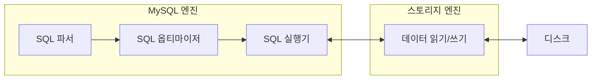

# 4.1 Mysql 엔진 아키텍처

## 4.1.1 MySQL의 전체 구조


### 대부분의 프로그래밍 언어로 MySQL 접근 가능
- C API, JDBC, .NET 등의 표준 드라이버 제공
- 드라이버 통해 C/C++, 자바, .NET등 대부분의 언어로 MySQL 서버에서 쿼리 사용 가능

### MySQL 서버 = MySQL 엔진 + 스토리지 엔진
- 핸들러 API 만족시 누구나 **스토리지 엔진** 구현하여 MySQL 서버에 추가 가능
- MySQL 서버에서 기본으로 제공해 주는 스토리지 엔진
    - InnoDB 스토리지 엔진
    - MyISAM 스토리지 엔진

### MySQL 엔진
- 커넥션 핸들러와 SQL 파서 및 전처리기, SQL 옵티마이저가 중심
    - 커넥션 핸들러: 클라이언트로부터의 접속, 쿼리 요청 처리
    - SQL 옵티마이저: 쿼리의 **최적화**된 실행
- 표준 SQL(ANSI SQL)문법 지원 -> 표준 문법에 따라 작성된 쿼리는 타 DBMS와 호환 가능
- MySQL 서버에서 MySQL 엔진은 하나
- **여러개의 스레드 생성 가능**(멀티 스레드)

### 스토리지 엔진
- 실제 데이터를 디스크 스토리지에 저장
- 디스크 스토리지로부터 데이터 읽어옴
- 여러개 동시 사용 가능
- InnoDB, MyISAM, Memory

### 핸들러 API
- MySQL 서버와 스토리지 엔진 간의 인터페이스(계약)를 정의하는 일련의 함수와 메서드들
- 스토리지 엔진이 MySQL 서버와 통신하며 데이터를 읽고 쓰는 등의 작업을 수행할 수 있도록 필요한 기능을 표준화해 제공
    - 예: 테이블 열기, 행 읽기/쓰기, 인덱스 관리, 잠금 처리 등
- 핸들러 호출의 카운터 값
  ```sql
  SHOW GLOBAL STATUS LIKE 'Handler%'
  ```
  
- [MySQL8.4 핸들러 API 코드](https://github.com/mysql/mysql-server/blob/8.4/sql/handler.h)

## 4.1.2 MySQL 스레딩 구조


- 스레드 기반으로 작동
- 포그라운드 스레드와 백그라운드 스레드로 구분
- 실행 중인 스레드 목록
    - `performance_schema`의 `threads`테이블에서 확인 가능
    ```sql
    SELECT thread_id, name, type, processlist_user, processlist_host FROM performance_schema.threads ORDER BY type, thread_id;
    ```
  
    
    - `thread/sql/one_connection`: 사용자 요청 처리 포그라운드 스레드
 
 ### 4.1.2.1 포그라운드 스레드(클라이언트 스레드)
- 최소한의 MySQL 서버에 접속된 클라이언트의 수만큼 존재
- 각 클라이언트 사용자가 요청하는 쿼리 문장 처리
- MySQL 엔진의 일부분(예: 커넥션 핸들러, SQL 파서, 옵티마이저)이 실행되는 실행 단위
- 한 커넥션 종료시, 해당 커넥션 담당 스레드는 스레드 캐시로 돌아감.
    - 단, 스레드 캐시에 일정 개수 이상의 대기 중인 스레드 존재하는 경우 -> 스레드 캐시에 넣지 않고 종료
    - `thread_cache_size`: 스레드 캐시에 유지할 최대 스레드 개수 시스템 변수
    - ```sql
      SHOW GLOBAL VARIABLES LIKE 'thread_cache_size';
      ```
      
- MySQL의 데이터 버퍼나 캐시로부터 데이터 가져옴
- 버퍼나 캐시에 없는 경우 -> 직접 디스크의 데이터나 인덱스 파일로 데이터 읽어옴
- MyISAM 테이블
    - 디스크 쓰기 작업까지 포그라운드 스레드가 처리
- InnoDB 테이블
    - 데이터 버퍼나 캐시 -> 포그라운드 스레드가 처리
    - 버퍼에서 디스크까지 기록 -> 백그라운드 스레드가 처리
        - 이유: **트랜잭션 지원 및 충돌 복구를 포함한 데이터 내구성 보장과, 동시에 성능 저하를 방지하기 위함**

 ### 4.1.2.2 백그라운드 스레드
 - InnoDB에서의 백그라운드 스레드 사용 사례
    - Insert Buffer를 병합하는 스레드
    - **로그를 디스크로 기록하는 스레드**
    - **InnoDB 버퍼 풀의 데이터를 디스크에 기록하는 스레드**
    - 데이터를 버퍼로 읽어 오는 스레드
    - 잠금이나 데드락을 모니터링하는 스레드
- 데이터의 읽기 작업은 절대 지연 X
    - 따라서 일반적인 상용 DBMS에는 대부분의 쓰기 작업을 버퍼링하여 일괄 처리함(InnoDB 또한 같은 방식)
    - InnoDB에서는 insert, update, delete 쿼리로 데이터 변경 경우, 디스크로 완전 저장까지 기다리지 않아도 됨.

## 4.1.3 메모리 할당 및 사용 구조


### 4.1.3.1 글로벌 메모리 영역
- 운영체제가 할당해 줌
    - 운영체제 종류에 따라 다름
- 하나의 메모리 공간 할당
    - 클라이언트 스레드와 무관
    - 필요에 따라 2개 이상의 메모리 공간 할당 받을 수 있음 
    - 모든 스레드에 공유
- 크기 주의해서 설정
- 예시
    - 테이블 캐시, InnoDB 버퍼 풀, InnoDB 어댑티브 해시 인덱스, InnoDB redo log 버퍼 등

### 4.1.3.2 로컬 메모리 영역
- == 세션 메모리 영역, 클라이언트 메모리 영역
- 클라이언트 스레드가 쿼리를 처리하는데 사용하는 메모리 영역
- 각 클라이언트 스레드별로 독립적으로 할당
    - 절대 공유 안됨
- 크기 크게 신경 안씀
    - 최악의 경우 MySQL 서버가 메모리 부족으로 멈출 가능성 존재(하지만 매우 희박)
    - 그래도 적절한 메모리 공간 설정이 좋다.
- 각 쿼리의 용도별로 필요할 때만 공간 할당 -> 필요하지 않는 경우 메모리 공간 할당 X
    - 예시. 소트 버퍼 or 조인 버퍼
- 커넥션 열린 동안 계속 할당된 상태로 남아 있는 공간 존재
    - 예시. 커넥션 버퍼, 결과 버퍼
- 쿼리 실행 순간에만 할당하고 해제하는 공간 존재
    - 예시. 소트 버퍼, 조인 버퍼
- 예시
    - 커넥션 버퍼, 정렬 버퍼, 조인 버퍼, 바이너리 로그 캐시, 네트워크 버퍼 등

## 4.1.4 플러그인 스토리지 엔진 모델

- 스토리지 엔진, 검색어 파서, 사용자 인증 등을 플러그인으로 구현하여 제공 가능

### MySQL 엔진과 스토리지 엔진의 처리 영역

- 대부분의 작업이 MySQL 엔진에서 처리
    - group by, order by 등 복잡한 처리는 MySQL 엔진의 **쿼리 실행기**에서 처리
- 데이터 읽기/쓰기 작업만 스토리지 엔진에서 처리
- 데이터 읽기/쓰기 작업 대부분 1건의 레코드 단위로 처리
- **쿼리 작업의 여러 하위 작업에서 각 하위 작업이 어디 영역에서 처리되는지 구분하는 것이 중요**

### 핸들러
- 기능 호출에 사용하는 객체
- MySQL 엔진이 스토리지 엔진을 조정하기 위해 사용
- MySQL 엔진이 각 스토리지 엔진에게 데이터를 읽어오거나 저장하도록 명령할 때 핸들러 사용

### MySQL 서버(mysqld)에서 지원되는 스토리지 엔진


- ```sql
    SHOW ENGINES;
    ```
- support 칼럼
    - `YES`: 현재 MySQL 서버에 해당 스토리지 엔진이 포함되어 있고, 활성화된 상태
    - `DEFAULT`: YES + 필수 스토리지 엔진
    - `NO`: 현재 MySQL 서버에 포함되지 않았음
    - `DISABLED`: 현재 MySQL 서버에는 포함됐지만, 비활성화된 상태

### 플러그인 확인 방법


- ```sql
     SHOW PLUGINS;
  ```
## 4.1.5 컴포넌트
- MySQL8.0부터 기존 플러그인 아키텍처 대체하는 아키텍처
- 플러그인 단점 보완
    - 오직 MySQL 서버와 인터페이스할 수 있고, 플러그인끼리 통신 X
        - MySQL 서버의 내부 API를 통해서만 동작하도록 설계되었다는 의미
    - MySQL 서버의 변수나 함수를 직접 호출하기 때문에 안전 X (캡슐화 X)
    - 상호 의존 관계를 설정할 수 없어서 초기화가 어려움

## 4.1.6 쿼리 실행 구조


### 4.1.6.1 쿼리 파서
- 사용자 요청으로 들어온 쿼리 문장을 토큰으로 분리 -> 트리 형태의 구조로 변경
    - 토큰: MySQL이 인식할 수 있는 최소 단위의 어휘나 기호
- 기본 문법 오류는 이 과정에서 오류 메시지 전달

### 4.1.6.2 전처리기
- 파서 트리 기반으로 쿼리 문장에 구조적인 문제점 확인
- 테이블 이름, 칼럼 이름, 내장 함수등의 객체 매핑 
<br> -> 객체 존재 여부, 개체 접근 권한 확인 과정

- 존재 X, 권한상 사용X인 경우 이 단계에서 걸러짐.

### 4.1.6.3 옵티마이저
- 사용자의 요청으로 들어온 쿼리 문장을 저렴한 비용으로 가장 빠르게 처리하는 방법 결정
- DBMS의 두뇌 역할

### 4.1.6.4 실행 엔진
- 만들어진 계획대로 각 핸들러에게 요청해서 받은 결과를 또 다른 핸들러 요청의 입력으로 연결하는 역할
- DBMS의 손과 발 역할
- 예시. 옵티마이저가 `GROUP BY` 처리하기 위해 임시 테이블을 사용하기로 결정한 상황
    1. 실행 엔진이 핸들러에게 임시 테이블을 만들라고 요청
    2. 다시 실행 엔진은 WHERE절에 일치하는 레코드를 읽어오라고 핸들러에게 요청
    3. 읽어온 레코드들을 1번에서 준비한 임시 테이블로 저장하라고 다시 핸들러에게 요청
    4. 데이터가 준비된 임시 테이블에서 필요한 방식으로 데이터를 읽어 오라고 핸들러에게 다시 요청
    5. 최종적으로 실행 엔진은 결과를 사용자나 다른 모듈로 넘김

### 4.1.6.5 핸들러(스토리지 엔진)
- MySQL 서버의 가장 밑단에서 MySQL 실행 엔진의 요청에 따라 데이터를 디스크로 저장하고 디스크로부터 읽어오는 역할

## 4.1.7 복제
- 한 서버(마스터)에서 발생한 데이터 변경 사항을 하나 이상의 다른 서버(슬레이브)로 전달하여, 데이터 동기화와 가용성, 부하 분산 등을 지원하는 기능

## 4.1.8 쿼리 캐시
- 빠른 응답을 필요로 하는 웹 기반의 응용 프로그램에서 매우 중요
- SQL 실행 결과를 메모리에 캐시 -> 동일한 SQL 실행시 즉시 결과 반환 가능
- 캐시된 내용에서 변경 발생할 경우 관련 내용 삭제 이슈 
    - -> **동시 처리 성능 저하 유발**
    - -> **성능 개선 과정에서 버그의 원인**
- MySQL8.0부터 쿼리 캐시는 MySQL 서버의 기능에서 완전히 제거
    - 관련 시스템 변수도 모두 제거

## 4.1.9 스레드 풀
- MySQL 서버 엔터프라이즈 에디션에서만 제공
- 동시에 처리되는 사용자 요청의 스레드 수를 제한
<br> -> 많은 요청이 들어오더라도 서버의 CPU는 미리 정해진 제한된 수의 스레드만 집중적으로 처리
<br> -> 자원 소모를 줄이고 성능을 최적화
- 제한된 수의 스레드만으로 CPU가 처리하도록 적절히 유도한다면 불필요한 문맥 교환 줄임 
<br> -> 오버헤드 낮춤 
- 주의
    - 스케줄링 과정에서 CPU 시간을 제대로 확보하지 못하는 경우 쿼리 처리가 더 느려질 가능성 존재


### Percona Server에서 제공하는 스레드 풀 기능
- 플러그인 형태로 작동
- MySQL 커뮤니트 에디션에서 사용하여 스레드 풀 기능 사용 가능하게 함
    - MySQL 커뮤니트 에디션과 동일 버전의 Percona Server 스레드 풀 플러그 라이브러리 설치하기
    - ```sql
       INSTALL PLUGIN thread_pool SONAME 'thread_pool.so';
      ```
- 기본적으로 CPU 코어 개수만큼 스레드 그룹 생성 (권장)
    - 스레드 그룹 `thread_pool_size`로 조정 가능
    - `thread_pool_size`: 스레드 그룹 개수 시스템 변수
- MySQL 서버가 처리해야 할 요청이 생기면 스레드 풀로 처리를 이관
    - 만약 이미 스레드 풀이 처리 중인 작업이 있는 경우에는 `thread_pool_oversubscribe` 시스템 변수(기본값 3)에 설정된 개수만큼 추가로 더 받아들여 처리
    - 해당 값이 너무 크면 스케줄링해야 할 스레드가 많아져 스레드 풀이 비효율적으로 작동 가능성 존재
- 스레드 그룹의 모든 스레드가 일을 처리하고 있는 경우
    - 스레드 풀은 해당 스레드 그룹에 새로운 작업 스레드를 추가할지, 
    <br> 기존 작업 스레드가 처리를 완료할 때까지 기다릴지 여부를 판단
    - **타이머 스레드**
        - 주기적으로 스레드 그룹의 상태 체크
        - `thread_pool_stall_limit`(시스템 변수)에 정의된 밀리초내에 작업 스레드가 처리중인 작업 못끝낸 경우 -> 새로운 스레드를 생성해서 스레드 그룹에 추가
            - 단, (전체 스레드 풀에 있는 스레드 개수) <= `thread_pool_max_threads` 이내여야 함.
        - 따라서, 모든 스레드 그룹의 스레드가 각자 작업 처리하고 있는 경우에 새로운 쿼리 요청 발생하면
        <br> ->  `thread_pool_stall_limit` 이상 기다려야 해당 요청 처리 가능
            - `thread_pool_stall_limit`는 스레드가 작업을 완료하지 못할 경우 추가 스레드 생성을 위한 기준 시간이지, 해당 시간 이후에 스레드가 종료되는 것은 아님
        - 응답 시간에 민감한 서비스인 경우
            - `thread_pool_stall_limit` 낮게 설정하기
            - 하지만 0에 가까운 값은 권장 X
                - 0에 가까우면 스레드풀 사용 안하는게 더 좋음
                - 매번 새로운 스레드 할당받아서 스레드 재사용성 줄어듦 -> 스레드 생성 오버헤드 중가 -> 성능 저하 유발
- 선순위 큐와 후순위 큐 이용 -> 특정 트랜잭션이나 쿼리 우선적 처리 기능 제공
    1. 먼저 시작된 트랜잭션 내에 속한 SQL 먼저 처리
    2. 해당 트랜잭션 잠금 빨리 해제
    3. Lock Contention 낮아짐
    4. 성능 향상

## 4.1.10 트랜잭션 지원 메타데이터
### 메타데이터
- 테이블의 구조 정보와 스토어드 프로그램등의 정보를 뜻함
- == 데이터 딕셔너리

### MySQL 5.7
- 테이블의 구조 정보와 스토어드 프로그램 정보 파일 기반으로 관리
    - 테이블의 구조 정보 -> FRM 파일
    - 스토어드 프로그램 정보 -> *.TRN, *.TRG, *.PAR 등
- 파일 기반 메타데이터 -> 생성 및 변경 작업이 트랜잭션 지원 X
    - 일관성 문제 발생

### MySQL 8.0
- 시스템 테이블, 데이터 딕셔너리(메타 데이터) 정보 -> mysql DB에 저장
    - mysql DB -> mysql.ibd(테이블스페이스)에 저장
    - 테이블의 구조 정보, 스토어드 프로그램의 코드 정보 -> InnoDB의 테이블에 저장
    - 시스템 테이블 -> InnoDB 스토리지 엔진 사용
        - 시스템 테이블: MySQL 서버가 작동하는데 기본적으로 필요한 테이블들
    - 데이터 딕셔너리 테이블의 데이터는 사용자가 못 봄
        - 임의로 수정하는 경우를 방지하기 위해
        - informaton_schema DB의 TABLES와 COLUMNS등의 뷰로 조회 가능
        - 테이블 관련 메타데이터 조회시 접근 거절
          ```sql
          select * from mysql.tables limit 1;
          ```
          
- 시스템 테이블, 데이터 딕셔너리 -> 트랜잭션 기반의 InnoDB 스토리지 엔진에 저장
    - 완전한 성공 or 완전한 실패
    - MySQL5.7 문제(작업 진행중인 상태로 남는 문제) 개선
- SDI(Serialized Dictionary Information) 파일
    - MyISAM, CSV등 InnoDB 사용 안하는 스토리지 엔진의 메타 정보 저장 공간
    - *.sdi 파일
    - 기존의 *.FRM 파일과 동일 역할

<br>

# 4.1 추가 내용

### InnoDB 스토리지 엔진
- 현재 MySQL의 기본 스토리지 엔진
- 트랜잭션 지원, 외래 키 제약조건, 충돌 복구, MVCC 등의 기능을 제공하여 안정성과 신뢰성이 높음
    - 백그라운드 스레드를 활용해 버퍼 풀의 더티 페이지를 디스크에 비동기적으로 플러시
        - 더티 페이지: 메모리(버퍼 풀)에서 수정된 후 아직 디스크에 기록되지 않은 데이터 페이지를 의미
    - 체크포인트 및 로그 기록 작업(redolog flush, crash recovery 준비)을 수행하여 데이터 내구성과 성능을 향상


### MyISAM 스토리지 엔진
- 과거에는 기본 엔진
- 읽기 성능이 빠르지만, 트랜잭션이나 외래 키 같은 기능은 지원하지 않음

### Memory (HEAP) 스토리지 엔진
- 테이블 데이터를 메모리에 저장하여 매우 빠른 읽기/쓰기 속도를 제공하는 엔진
-  데이터를 메모리에만 저장하기 때문에 MySQL 서버가 재시작되면 데이터가 모두 사라지는 휘발성

### MySQL: 스레드 기반
- 장점
    - 스레드가 프로세스보다 생성과 전환 비용이 낮아 많은 클라이언트를 효율적으로 처리
    - 동일 프로세스 내 스레드 간 메모리 공유를 통해 캐시 및 버퍼를 효과적으로 활용 -> I/O 성능을 향상
    - 멀티코어 환경에서 각 스레드가 병렬로 실행 -> 동시 요청 처리에 유리
- 단점
    - 한 스레드에서 발생한 치명적인 오류가 같은 프로세스 내 다른 스레드에도 영향을 미칠 가능성 존재
    - MySQL은 내부적으로 오류 격리 및 예외 처리를 통해 이를 완화함
- 사용 사례
    - 빠른 응답과 높은 동시 연결이 중요한 웹 애플리케이션 등에서 많이 사용


### PostgreSQL: 프로세스기반
- 장점
    - 각 연결이 별도의 프로세스로 실행 -> 한 프로세스에서 문제가 발생해도 다른 연결에 영향을 안줌(격리성 높음)
- 단점
    - 프로세스 생성 및 문맥 전환 비용이 상대적으로 큼 -> 매우 많은 동시 연결을 처리할 때는 오버헤드가 증가
- 사용 사례
    - 안정성과 데이터 무결성이 중요한 애플리케이션
    - 복잡한 쿼리 및 대용량 데이터 처리가 필요한 환경

### Lock Contention (잠금 경합)
- 여러 스레드나 프로세스가 동일한 락을 동시에 요청하여, 하나의 스레드가 락을 획득하는 동안 다른 스레드들이 기다려야 하는 상황
- 주로 성능 저하를 유발
    - 하나의 락을 여러 스레드가 기다리며 블록되거나, CPU 리소스가 낭비되기 때문에 전체 시스템의 처리량이 떨어질 수 있음
    - 여러 스레드가 동시에 실행되려고 할 때 락 하나에 대한 경쟁으로 인해 병목 현상이 발생해 전체 시스템의 처리 속도가 떨어짐

### Race Condition
- 여러 스레드가 공유 자원에 대해 동시 접근하거나 수정할 때, 동기화가 제대로 이루어지지 않아 예측 불가능한 결과나 데이터 불일치가 발생하는 상황
