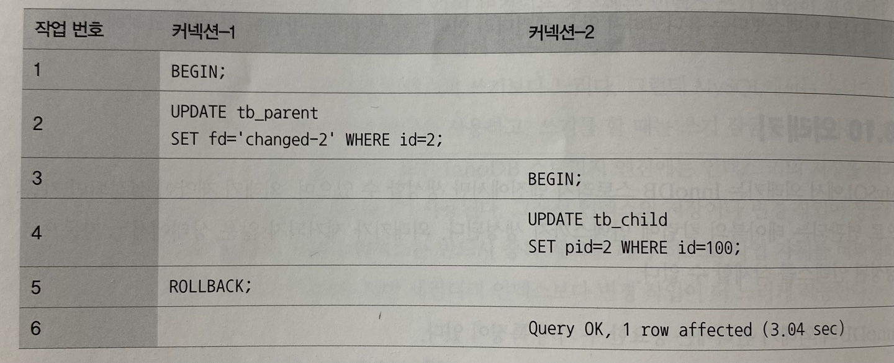
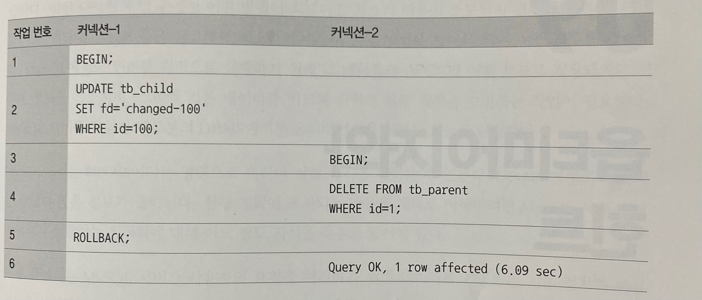

# 8.1 외래키
- InnoDB에서만 외래키 생성 가능
- 외래키 제약이 설정되면 자동으로 연관되는 테이블의 칼럼에 인덱스까지 생성
- 외래키가 제거되지 않은 상태에서는 자동으로 생성된 인덱스 삭제 못함

<br>

## InnoDB 외래키 관리의 특징
1. 테이블 변경(쓰기 잠금)이 발생하는 경우에만 잠금 경함(잠금 대기)가 발생
2. 외래키와 연관되지 않은 칼럼의 변경은 최대한 잠금 경합(잠금 대기)를 발생시키지 않는다.

```sql
CREATE TABLE tb_parent (
    id INT NOT NULL,
    fd VARCHAR(100) NOT NULL, 
    PRIMARY KEY(id)
) ENGINE=InnoDB;

CREATE TABLE tb_child (
    id INT NOT NULL,
    pid INT DEFAULT NULL,
    fd VARCHAR(100) NOT NULL,
    PRIMARY KEY(id),
    KEY ix_parentid(pid),
    CONSTRAINT child_ibfk_1 FOREIGN KEY(pid) REFERENCES tb_parent(id) ON DELETE CASCADE
) ENGINE=InnoDB

INSERT INTO tb_parent VALUES(1, 'parent-1'), (2, 'parent-2');
INSERT INTO tb_child VALUES(100, 1, 'child-100');
```

## 8.10.1 자식 테이블의 변경이 대기하는 경우



- `tb_child`가 `update`(작업번호 4번)하기 전 `tb_parent`의 잠금 여부를 확인하고, 잠금(현재 작업 번호 2번에 의해 쓰기 잠금 걸린 상태)인 경우, 잠금이 해제될 때까지 기다린다. -> InnoDB 외래키 관리 첫 번째 특징
- 자식 테이블의 외래키가 아닌 칼럼의 변경은 외래키로 인한 잠금 확장(기다리는 상태)이 발생하지 않는다. -> InnoDB 외래키 관리 두 번째 특징

## 8.10.2 부모 테이블의 변경 작업이 대기하는 경우



- 작업번호 2번에 의해서 `tb_child` 레코드에 대해 쓰기 잠금을 획득한다.
   - id 100인 `tb_child` 레코드는 `tb_parent` 레코드 id 1을 외래키(pid)로 가지고 있다.
- 이 상태에서 작업번호 4번에 의해 `tb_parent` 레코드 id 1을 `delete`하기 위해서는 `tb_child` 레코드에 대해 쓰기 잠금이 해제될 때까지 기다려야 한다.
    - 자식 테이블이 생성될 때 정의된 외래키의 특성(ON DELETE CASCADE) 때문에 부모 레코드가 삭제되면 자식 레코드도 동시에 삭제되어야 하기 때문

<br>

## 외래 키를 생성할 때, 잠금 경합까지 고려해서 모델링을 진행하자!
- 잠금이 다른 테이블로 확장되면 그만큼 전체적으로 쿼리의 동시 처리에 영향을 미치기 때문
